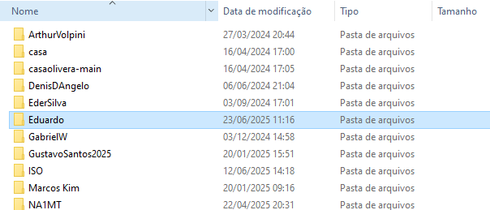
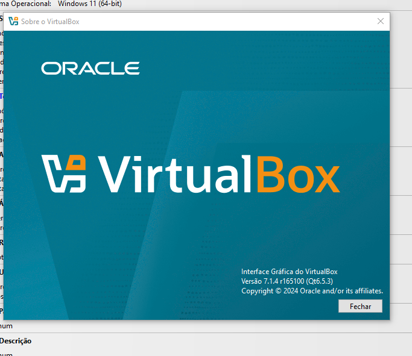
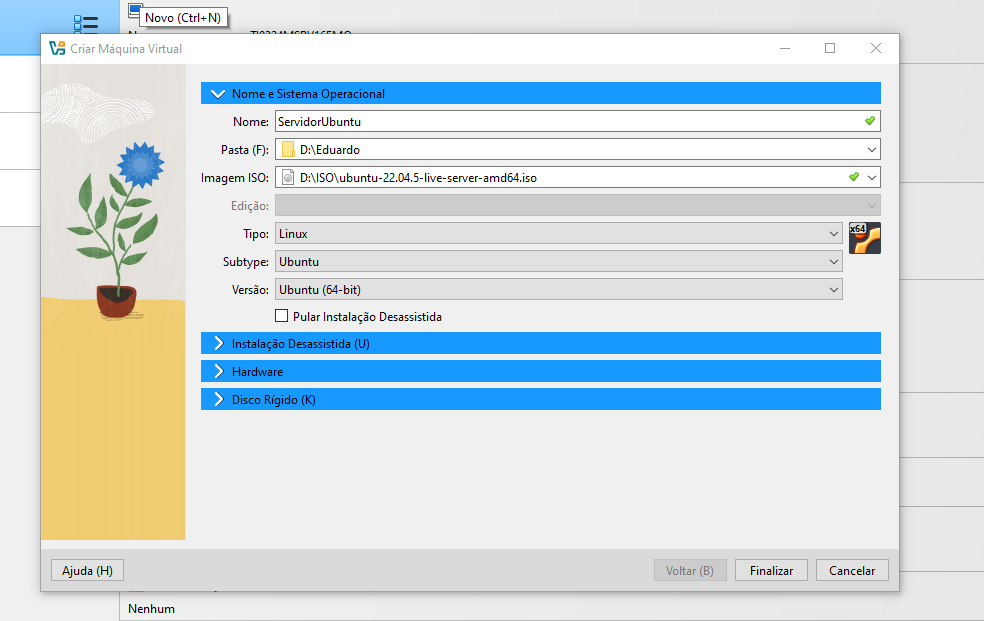
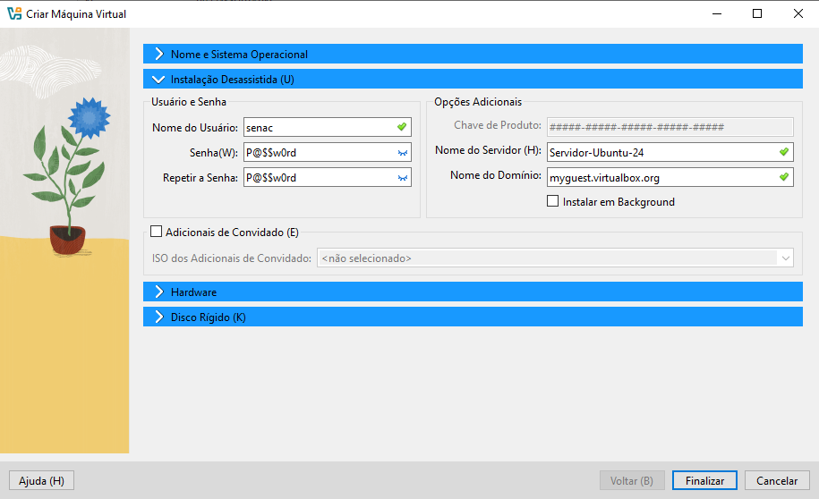
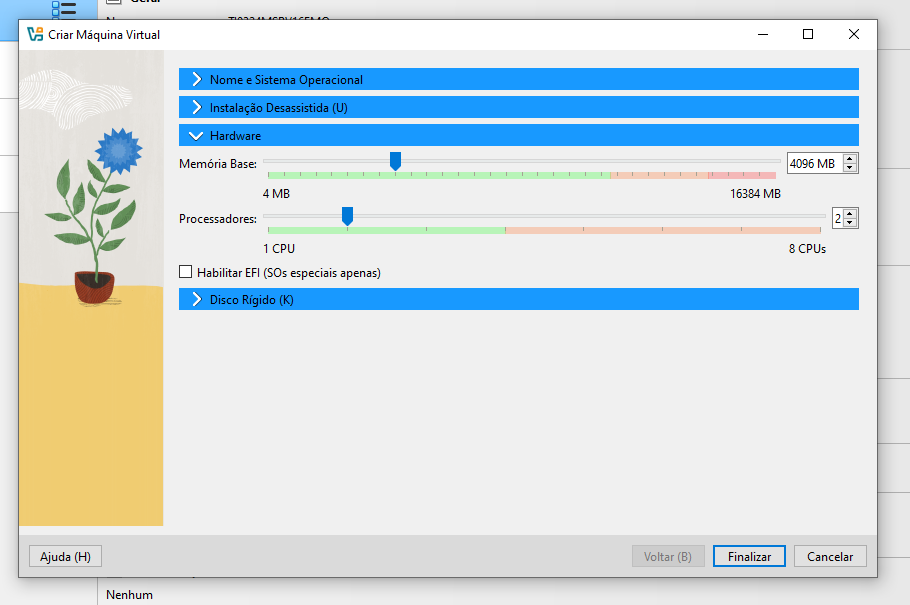
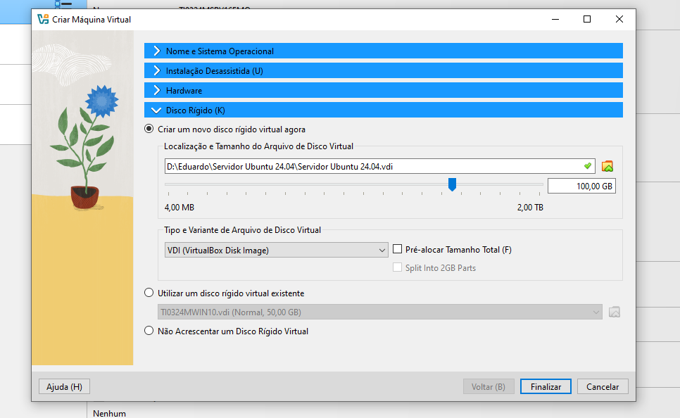
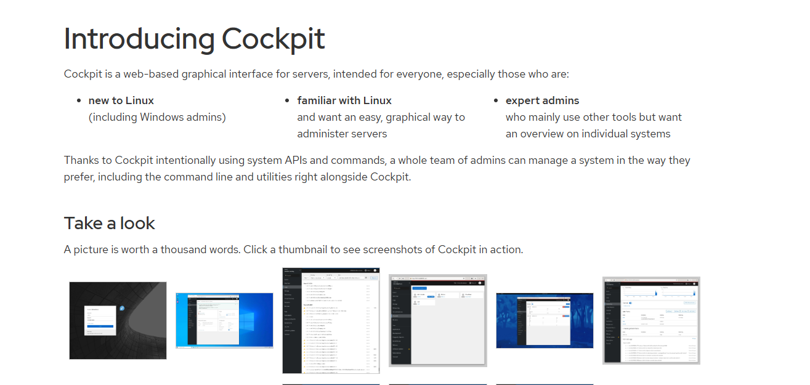

# Preparação de ambiente
Criar uma máquina virtual para instalar as ferramentas e dependências para o estudo de algoritmo e lógica de programação 

## Criar o diretório base
Vamos criar um diretório para guardar a nossa máquina virtual. Será criado no Drive D. Nomeada com o nome do usuário.



## Preparação da máquina virtual
### vamos usar a ferramenta de visualização chamada Virtual Box



<a href="https://www.virtualbox.org/wiki/Downloads">Faça o download aqui</a>

## Criando a máquina virtual










## Pós instalação:

Para atualizar oa sistema iremos usar os seguintes comandos:

```shell
sudo apt update -y

```

```shell
sudo apt upgrade -y
```


ou

```shell
sudo apt updat -y && sudo apt upgrade -y
```

## instalação do cockpit

Ferramenta para gerenciar o servidor, por meio de um ambiente gráfico online



```shell
sudo apt install cockpit -y
```


